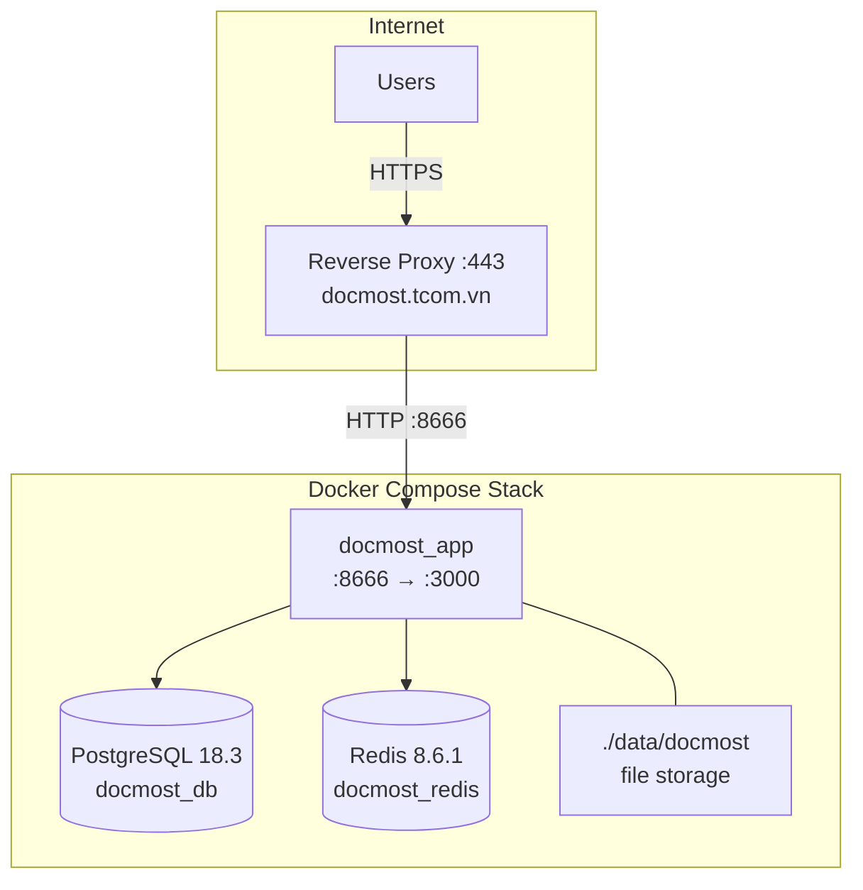

# Docmost (Production — tcom.vn)

Collaborative documentation platform running at **https://docmost.tcom.vn**.

- **Version**: 0.70.1 (pinned)
- **Internal port**: 8666 → container :3000
- **Domain**: `docmost.tcom.vn`

## Architecture



## Directory Layout

```
docmost/
├── docker-compose.yml
├── .env                        # All secrets and config
└── data/
    ├── docmost/                # Uploaded files, attachments
    ├── postgres/               # PostgreSQL data
    └── redis/                  # Redis AOF persistence
```

Data uses **bind mounts** (`./data/`) instead of named Docker volumes — files are directly accessible on the host filesystem.

## Docker Compose Stack

Three containers, all `restart: unless-stopped` with log rotation (`10m × 3 files`):

| Container | Image | Role | Exposed |
|-----------|-------|------|---------|
| `docmost_app` | `docmost/docmost:0.70.1` | App server | `0.0.0.0:8666→3000` |
| `docmost_db` | `postgres:18.3` | Database | Internal only |
| `docmost_redis` | `redis:8.6.1` | Cache / queue | Internal only |

All images are **pinned to exact versions** — no `:latest` tags.

### Bind Mounts

| Host Path | Container Path | Purpose |
|-----------|----------------|---------|
| `./data/docmost` | `/app/data/storage` | Uploaded files, attachments |
| `./data/postgres` | `/var/lib/postgresql` | PostgreSQL data |
| `./data/redis` | `/data` | Redis AOF persistence |

### Log Rotation

All containers use the `json-file` driver with:
- **Max size**: 10 MB per log file
- **Max files**: 3 (rotated)

Prevents unbounded log growth on disk.

## Configuration

All config is loaded from a **`.env` file** (shared by both `docmost` and `db` services). Expected variables:

```bash
# Docmost
APP_URL=https://docmost.tcom.vn
APP_SECRET=<random-secret>
DATABASE_URL=postgresql://<user>:<password>@db:5432/<dbname>
REDIS_URL=redis://redis:6379

# PostgreSQL
POSTGRES_DB=<dbname>
POSTGRES_USER=<user>
POSTGRES_PASSWORD=<password>
```

### Redis

Running with `--appendonly yes` (AOF persistence) and `--maxmemory-policy noeviction` — no data is silently dropped.

## Reverse Proxy

The app listens on port **8666**. Route HTTPS traffic from `docmost.tcom.vn` to `http://localhost:8666` (or `http://host.docker.internal:8666`) in your reverse proxy.

Example Traefik router:

```yaml
http:
  routers:
    docmost:
      rule: "Host(`docmost.tcom.vn`)"
      entryPoints: [websecure]
      service: docmost
  services:
    docmost:
      loadBalancer:
        servers:
          - url: "http://host.docker.internal:8666"
```

## Deployment & Updates

```bash
# Start / recreate
docker compose up -d

# Update to a new version — edit image tag in docker-compose.yml, then:
docker compose pull
docker compose up -d

# Check logs
docker compose logs -f docmost

# Restart without pulling
docker compose restart

# Full teardown (data preserved in ./data/)
docker compose down
docker compose up -d
```

## Backup

Since data lives in bind mounts, backups are straightforward filesystem copies:

```bash
# Stop writes for consistency (optional but recommended)
docker compose stop

# Archive everything
tar czf docmost-backup-$(date +%F).tar.gz data/

# Or backup individually:
# Database dump (while running)
docker exec docmost_db pg_dump -U <user> <dbname> > docmost_backup.sql

# File storage
cp -r data/docmost/ ./docmost-storage-backup/

# Resume
docker compose start
```

### Restore

```bash
# Database
cat docmost_backup.sql | docker exec -i docmost_db psql -U <user> <dbname>

# File storage
cp -r ./docmost-storage-backup/. data/docmost/

# Or full restore from archive
tar xzf docmost-backup-<date>.tar.gz
docker compose up -d
```

## Monitoring

```bash
# Container health
docker ps --filter 'name=docmost_'

# Resource usage
docker stats --no-stream --filter 'name=docmost_'

# Database size
docker exec docmost_db psql -U <user> -c "SELECT pg_size_pretty(pg_database_size('<dbname>'));"

# Redis memory
docker exec docmost_redis redis-cli info memory | grep used_memory_human

# Disk usage (bind mounts)
du -sh data/*/
```
