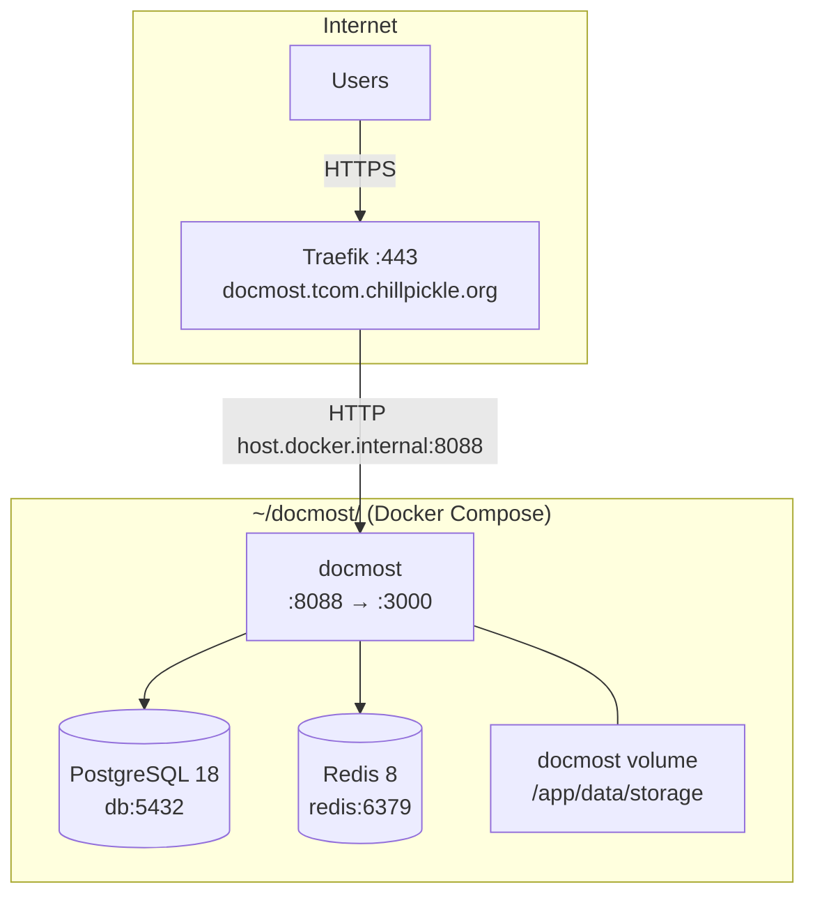

# Docmost

Collaborative documentation platform running at **https://docmost.tcom.chillpickle.org**.

- **Version**: 0.70.1 (`docmost/docmost:latest`)
- **Compose dir**: `~/docmost/`
- **Internal port**: 8088 → container :3000

## Architecture



## Directory Layout (on server)

```
~/docmost/
└── docker-compose.yml      # Single file — no .env, all config inline
```

## Docker Compose Stack

Three containers, all `restart: unless-stopped`:

| Container | Image | Role | Exposed |
|-----------|-------|------|---------|
| `docmost-docmost-1` | `docmost/docmost:latest` | App server | `0.0.0.0:8088→3000` |
| `docmost-db-1` | `postgres:18` | Database | Internal only |
| `docmost-redis-1` | `redis:8` | Cache / queue | Internal only |

### Volumes

| Volume | Mount | Purpose |
|--------|-------|---------|
| `docmost_docmost` | `/app/data/storage` | Uploaded files, attachments |
| `docmost_db_data` | `/var/lib/postgresql` | PostgreSQL data |
| `docmost_redis_data` | `/data` | Redis AOF persistence |

All volumes use the default `local` driver and live under `/var/lib/docker/volumes/`.

## Configuration

All config is set via environment variables in `docker-compose.yml` (no `.env` file):

| Variable | Value |
|----------|-------|
| `APP_URL` | `https://docmost.tcom.chillpickle.org` |
| `APP_SECRET` | Inline in compose file |
| `DATABASE_URL` | `postgresql://docmost:***@db:5432/docmost` |
| `REDIS_URL` | `redis://redis:6379` |

### Database Credentials

- **User**: `docmost`
- **Database**: `docmost`
- **Password**: Set in both `DATABASE_URL` and `POSTGRES_PASSWORD`

### Redis

Running with `--appendonly yes` (AOF persistence) and `--maxmemory-policy noeviction` so no data is silently dropped.

## Traefik Routing

Defined in `~/traefik/dynamic/routes.yml`:

```yaml
# Router
docmost:
  rule: "Host(`docmost.tcom.chillpickle.org`)"
  entryPoints: [websecure]
  service: docmost

# Service
docmost:
  loadBalancer:
    servers:
      - url: "http://host.docker.internal:8088"
```

No extra middleware — no basic auth, rate limiting, or IP allowlists.

## Deployment & Updates

```bash
# SSH in
ssh chillpickle-chill

# Pull latest image and recreate
cd ~/docmost
docker compose pull
docker compose up -d

# Check logs
docker compose logs -f docmost

# Restart without pulling
docker compose restart

# Full teardown (data preserved in volumes)
docker compose down
docker compose up -d
```

### Backup

```bash
# Database dump
docker exec docmost-db-1 pg_dump -U docmost docmost > docmost_backup.sql

# File storage (attachments)
docker cp docmost-docmost-1:/app/data/storage ./docmost-storage-backup

# Or backup the volume directly
sudo cp -r /var/lib/docker/volumes/docmost_docmost/_data ./docmost-storage-backup
```

### Restore

```bash
# Database restore
cat docmost_backup.sql | docker exec -i docmost-db-1 psql -U docmost docmost

# File storage restore
docker cp ./docmost-storage-backup/. docmost-docmost-1:/app/data/storage
```

## Networking

- Runs on the `docmost_default` Docker bridge network (isolated)
- Traefik reaches Docmost via `host.docker.internal:8088`, not by joining the network
- Port 8088 is bound to `0.0.0.0` on the host but blocked by UFW — only Traefik can reach it internally

## Monitoring

```bash
# Container health
docker ps --filter 'name=docmost'

# Resource usage
docker stats --no-stream --filter 'name=docmost'

# Database size
docker exec docmost-db-1 psql -U docmost -c "SELECT pg_size_pretty(pg_database_size('docmost'));"

# Redis memory
docker exec docmost-redis-1 redis-cli info memory | grep used_memory_human
```
