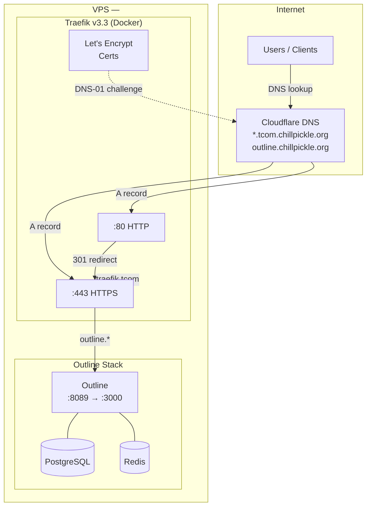
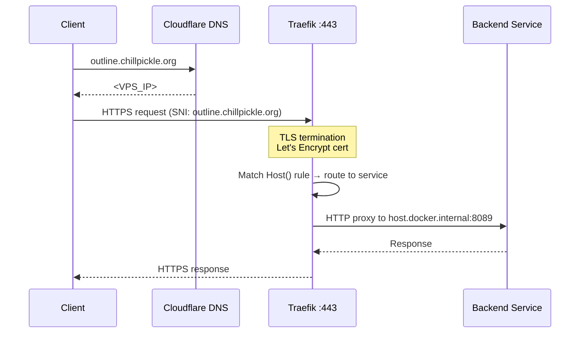
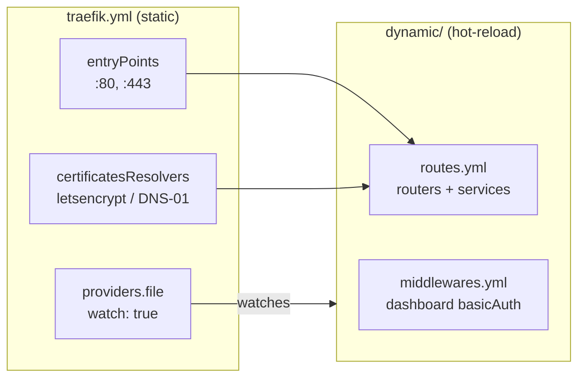
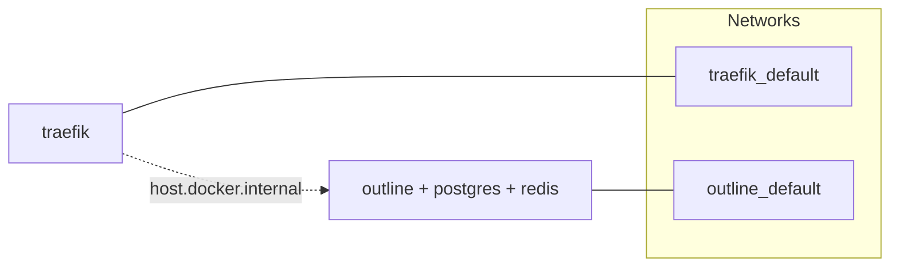

# Chillpickle VPS Infrastructure

## Architecture Overview



## Request Flow



## Services

| Service | URL | Internal Port | Docker Compose |
|---------|-----|---------------|----------------|
| Outline | https://outline.chillpickle.org | 8089 | `services/outline/` |
| Traefik Dashboard | https://traefik.tcom.chillpickle.org | -- | `services/traefik/` |

## Traefik Configuration

File-based config (no Docker labels, no Docker socket mount).



### Key files (in repo)

```
traefik/
├── docker-compose.yml          # Traefik container definition
├── .env.enc                    # CF_DNS_API_TOKEN (sops-encrypted)
├── traefik.yml                 # Static config: entrypoints, ACME, providers
└── dynamic/
    ├── routes.yml              # Routers + services (host rules → backends)
    └── middlewares.yml         # Dashboard basic auth
```

On the server, `acme/acme.json` (Let's Encrypt cert storage, chmod 600) is generated at runtime and not tracked in the repo.

### Adding a new service

1. Add a router + service block to `traefik/dynamic/routes.yml`:
   ```yaml
   http:
     routers:
       myapp:
         rule: "Host(`myapp.tcom.chillpickle.org`)"
         entryPoints: [websecure]
         service: myapp
     services:
       myapp:
         loadBalancer:
           servers:
             - url: "http://host.docker.internal:PORT"
   ```
2. Traefik picks it up automatically (file watcher). No restart needed.
3. The wildcard cert already covers `*.tcom.chillpickle.org`. For other domains, add them to `traefik.yml` TLS domains list.

## TLS / Certificates

- **Certs**: Wildcard `*.tcom.chillpickle.org` + `tcom.chillpickle.org` + `outline.chillpickle.org`
- **Issuer**: Let's Encrypt (production)
- **Challenge**: DNS-01 via Cloudflare API
- **Auto-renewal**: Traefik renews ~30 days before expiry
- **Token**: Stored in `services/traefik/.env.enc` (sops-encrypted) — has IP restriction (VPS only)

## DNS (Cloudflare)

- **Zone**: `chillpickle.org` (zone ID: `58990c231e0dc7ed163b086df437b4ab`)
- **Records**:

| Type | Name | Content | Proxied |
|------|------|---------|---------|
| A | `tcom.chillpickle.org` | <VPS_IP> | No |
| A | `*.tcom.chillpickle.org` | <VPS_IP> | No |
| A | `outline.chillpickle.org` | <VPS_IP> | No |

DNS-only (grey cloud) — Traefik handles TLS termination, not Cloudflare.

## Firewall (UFW)

| Port | Service |
|------|---------|
| 22 | SSH |
| 80 | Traefik HTTP (redirects to 443) |
| 443 | Traefik HTTPS |
| 40831 | aaPanel admin |

Direct service ports (8089) are closed. All traffic goes through Traefik.

## Server Resources

- **RAM**: 3.8 GB + 4 GB swap (swappiness=10)
- **CPU**: 2 vCPUs
- **Disk**: 38 GB (aaPanel nginx stopped, not removed)
- **OS**: Ubuntu (Debian-based)

## Docker Stacks



Each stack has its own isolated Docker network. Traefik reaches services through `host.docker.internal` (mapped to the host's network via `extra_hosts`), not by joining their networks.

## Maintenance

```bash
# SSH access
ssh chillpickle-chill

# View all containers
docker ps --format 'table {{.Names}}\t{{.Status}}\t{{.Ports}}'

# Traefik logs
cd ~/traefik && docker compose logs -f traefik

# Restart a stack
cd ~/traefik && docker compose restart
cd ~/outline && docker compose restart

# Check resources
free -h && docker stats --no-stream

# Manual deploy from local machine
./scripts/deploy.sh traefik
./scripts/deploy.sh outline
```
